# Kubernetes modules
- Masters
- Nodes
- Pods
- Services
- Deployments

# Overview
- Kubernetes is orchestration tool for Microservice apps

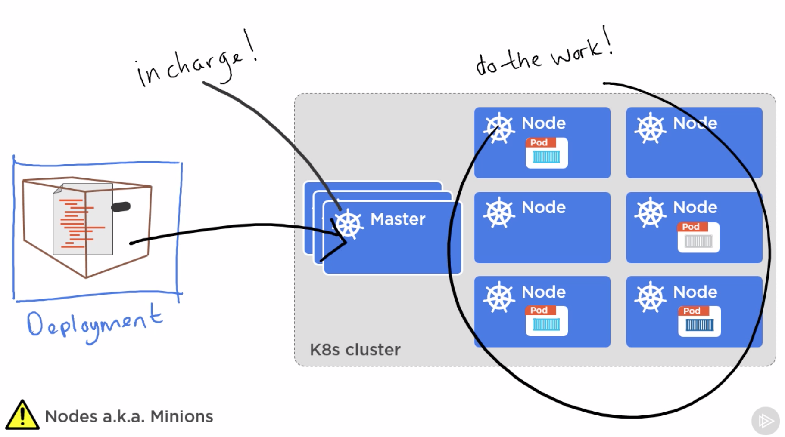

# Masters
- The kubernetes control panel
- Kubernetes clusters are bunch of masters and nodes
- Kubernetes is platform agnostic
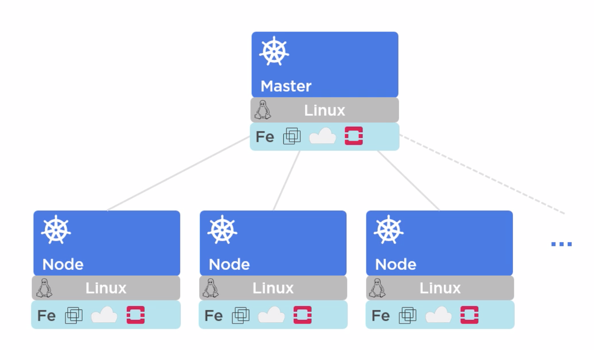
- Master runs on single server

Following is design of master:
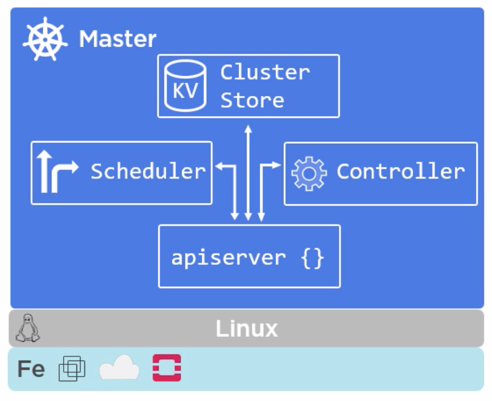
- api-server is frontend to master
- api-server is only component in master which we as a developer deal with it.
- Sometime we call `api-server` as master
- `master` is brain of kubernetes.
- commands comes to `api-server`

## kube-api server
- Front end to control panel
- Exposes REST API 
- Consumes JSON using menifest file
- It is brain of server
## Cluster store
- It is a memory of server
- Config and state of server is stored here.
- It uses `etcd`. `etcd` is a open source distributed key/value store. It is developed by `coreos` team.  
- Kubernetes uses `etcd` as a single source of truth for cluster.
- Its recommended to have a solid backup plan for `etcd`

## Kube Controller Manager
Its a kind of controller of controller. It has following controllers.
- Node controller
- Endpoint controller
- Namespace controller
Its sitting and watch for changes. It helps to matches desire state. 

## Kube Scheduler
- It watches `api-server` for new `pod`
- Assign works to `node`
- It takes care of following
1. afinity/anti-afinity
2. constraints
3. resources

# Nodes
- Nodes are kubernetes workers.
- It was used to be called minions.
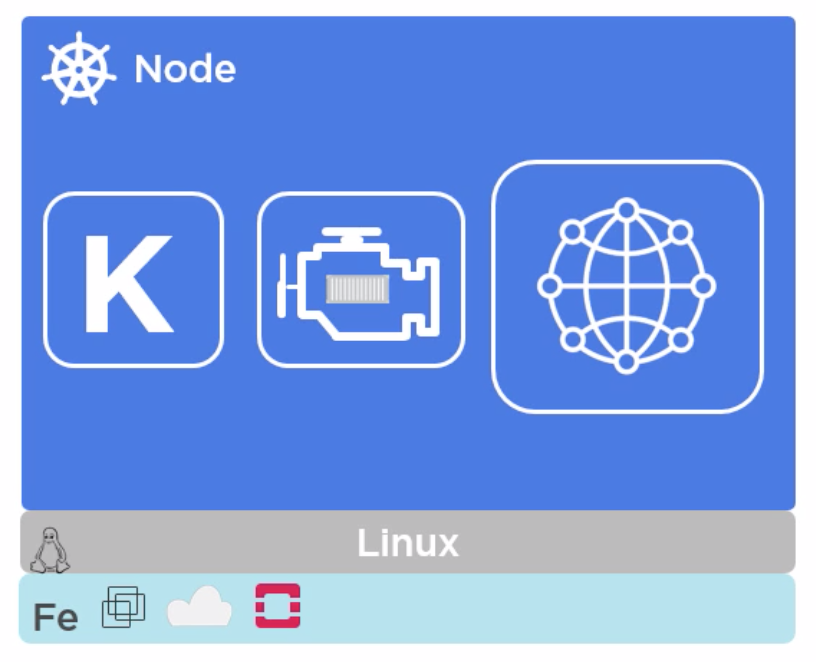

## kubelet
- It is a main kubernetes agent on node.
- It register node with cluster.
- It watches for `api-server` of master for work assignment.
- It carried over task.
- It instantiated `pods`
- Reports back to `master`
- If for some reason `kubelet` can't run work, or something gets wrong, its report back to `master` and control panel in master decides what to do.
- If a pod fails on the node, `kublet` is not responsible for restarting node to run the work. It simply report state back to `master`
- kubelet expose end point at `localhost` at port `10255` which we can inspect it.
- `/spec` endpoint returns details about node
- `/healthz` returns health of the node.
- `/pods` shows running pods.

## Container Engine
- One or more containers are package together and deployed together as single unit is called `pod`.
- Since it has `container` insdie, `kublet` needs to work with container run time to do the container management
- It does pull images
- It takes care of starting/stopping container

## Kube proxy
- This is like network brains of node
- It makes sure every pod gets unique ip
- I.e single ip per pod
- All containers in a pod share a single ip
- It also does load balancer across all pods in service
- `service` is way to hide multiple `pods` under single network. 
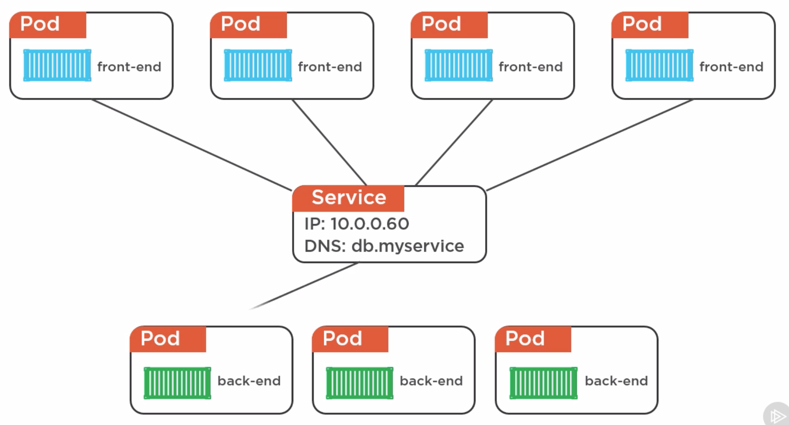

# Declarative Model and Desired State
- Kubernetes works on declarative way.
- YAML or JSON is used to describe desired state.
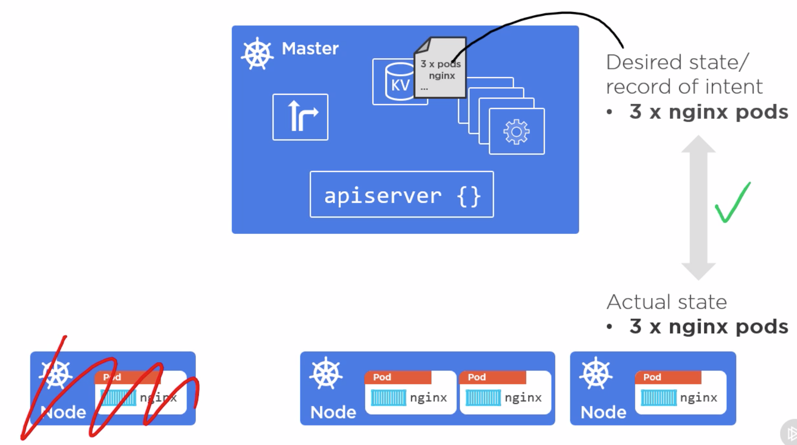 

# Pods
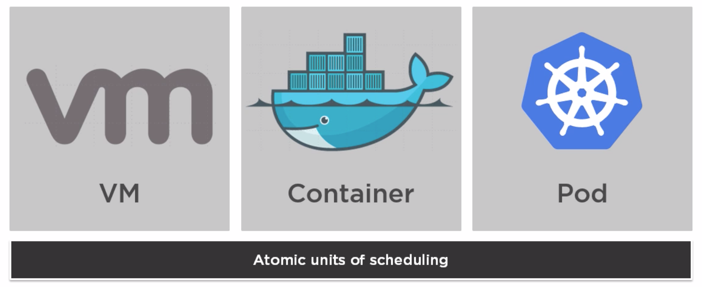 
- Kubernetes runs container, but always inside of `pods`
- `pods` can have multiple containers. However this is a advance use cases.
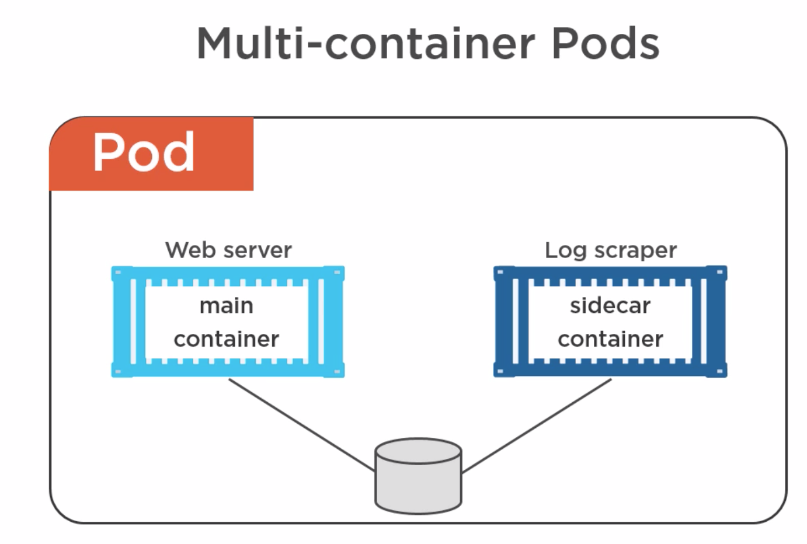 
- `pods` is an ring fenced environment to run container.
- All containers in `pods` share the `pods` environment.
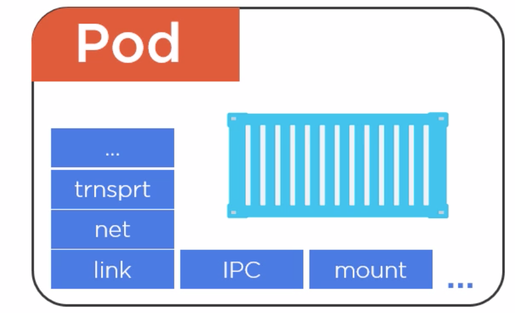 
- Units of scaling in kubernetes are `pods`
- We do not scale by adding more containers in `pods`
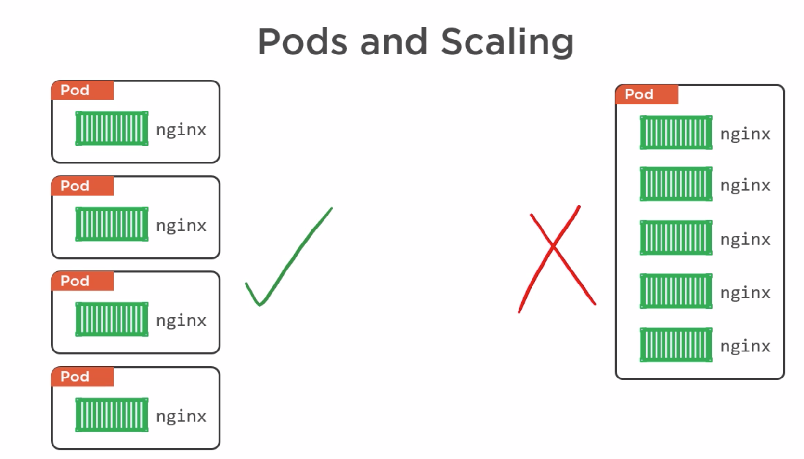 
- Deployments of `pods` are all or nothing job.
- `pods` live on single node. We cannot have one `pod` running on multiple servers.
## Pod LifeCycle
- born
- live
- die
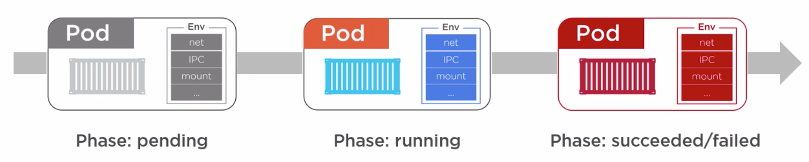 

## Deploying pods
- It can be deployed directly by giving the manifest file
- Replication controller is used to maintain the required number of replica needed for that `pod`
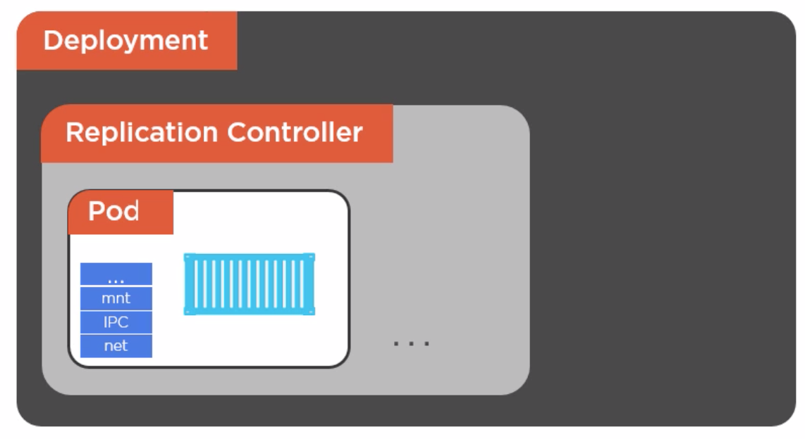 

# Services
- Every pod has their own ip
- It may sometime end up with ip churn
- Service helps to resolve ip problem
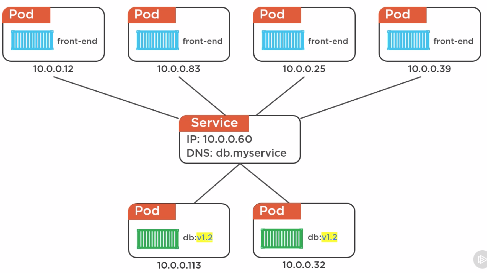 
- `pods` are belongs to `service` via label
- label helps to auto connect new `pod` into label
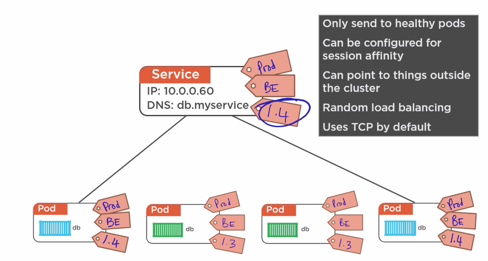 

# Replicator controller
- We do not work with `pod` directly.
- We use replicator controller to deploy `pods`
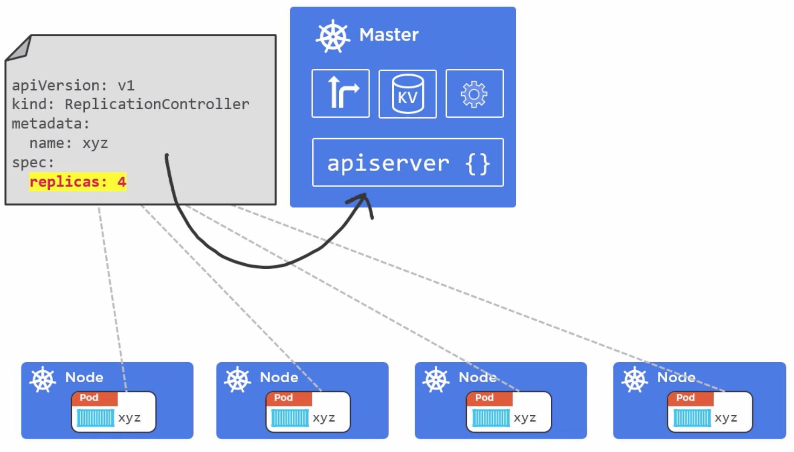 

# Deployment
- Deployment is all about declarativeness
- Its self documenting
- It versioned
- Spec one and deploy many times
- Simple rollout and rollback
- Deployments are proper first class REST object
- Define spec in either YAML or JSON file
- It deployed via api server
- In deployment world, Replication Controllers is replaced by Replica Sets
- Replica Sets is similar to Replication Controller, its kind of next version
- Rolling update is core feature of Deployment
- We can run multiple concurrent versions as blue-green deployment or canary fashion
- 

